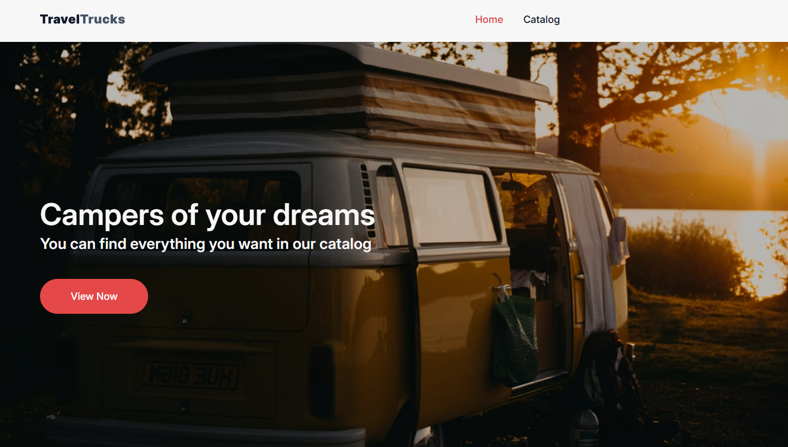
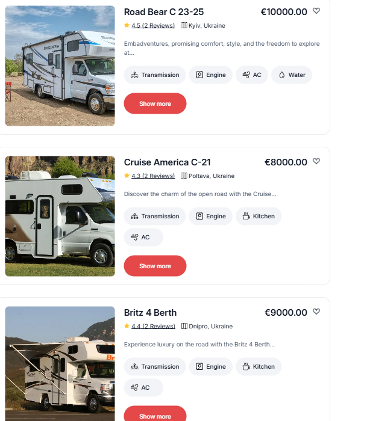
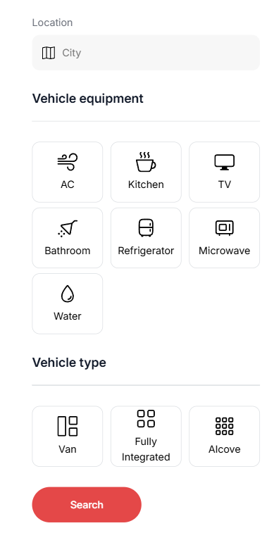
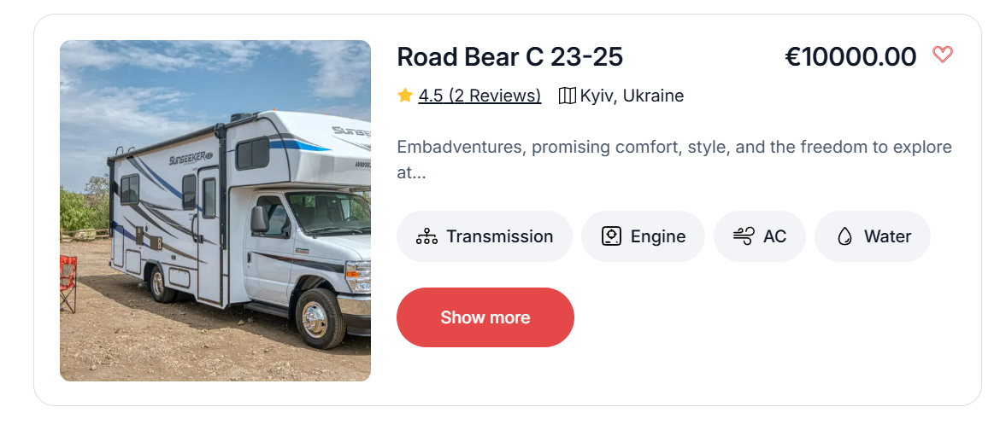
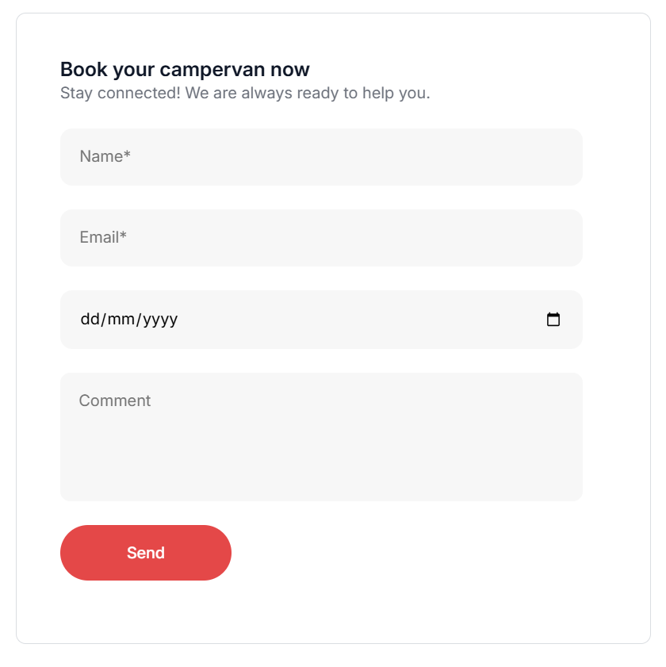

# Campervan Rental

 
Start your journey with us

## About us

Simple application for browsing and renting campervans in Ukraine.

  

## Features

1. Browse a list of available campervans.

  

2. Filter them by location, equipment and vehicle type.

  

3. Favorite the ones you like.

  

4. Book an appoitment for renting within few minutes.

  

## Used Technologies

